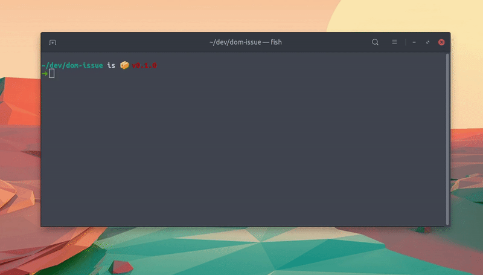

# where-broke

<!-- ALL-CONTRIBUTORS-BADGE:START - Do not remove or modify this section -->
[](#contributors-)
<!-- ALL-CONTRIBUTORS-BADGE:END -->

**Find the version of a lib that broke your tests**



Most often when there is a regression in a lib that we use, we want to know what the last working version was. This project helps you find that version!

## Usage

Run the following command in the root of the the project that contains the breaking test (next to `package.json`). Replace `{lib}` with the module name that you wish to bisect.

```shell
npx where-broke {lib}
```

## Requirements

To make this work, the project should match the following requirements:

- there should be a `package.json` in the project root
- there should be a `test` script defined in `package.json`
- `npm run test` returns a non-zero exit code in case of failure
- `npm run test` returns a zero exit code in case of success

## Example

For example, at a certain moment, `@testing-library/dom` contained a breaking change that made `getByRole('form')` fail when the `form` element didn't have an explicit `role` defined. To trace this breaking change down, the first thing we need to do is create a reproduction.

For this specific case, the following test would throw on their latest version:

```js
import { getQueriesForElement } from '@testing-library/dom';

function render(html) {
  const container = document.createElement('div');
  container.innerHTML = html;

  return getQueriesForElement(container);
}

test('finds form without role', () => {
  const { getByRole } = render('<form />');
  getByRole('form');
});
```

To test this, we would make sure that this script is triggered when running `npm run test`. I used the `test` method from `jest`, but any test script that returns a non-zero exit code on fail, works.

Now, instead of `npm run test`, we run:

```shell
npx where-broke @testing-library/dom
```

This will take some time, as it will run until it finds the breaking version.

But no worries, we're not going to test them all. We use a "binary search" to speed up the process. Basically, we'll cut the apple in halves, until we find the rotten part.

```shell
~/dev/dom-issue
➜ npx where-broke @testing-library/dom
npx: installed 37 in 2.088s

Check for regression in @testing-library/dom

ℹ Found 111 versions, will need to test 7 of them

✖ @testing-library/dom@7.0.2
✔ @testing-library/dom@6.4.0
✔ @testing-library/dom@6.12.0
✖ @testing-library/dom@6.16.0
✔ @testing-library/dom@6.14.0
✖ @testing-library/dom@6.15.0
✖ @testing-library/dom@6.14.1

  The tests passed in 6.14.0 and fail since 6.14.1
```

Now we know, that the breaking change was introduced in `6.14.1`. The last version that we can use is `6.14.0`, and we can tell the project maintainers that they should look for the cause between `6.14.0` and `6.14.1`;

## Contributors ✨

Thanks goes to these wonderful people ([emoji key](https://allcontributors.org/docs/en/emoji-key)):

<!-- ALL-CONTRIBUTORS-LIST:START - Do not remove or modify this section -->
<!-- prettier-ignore-start -->
<!-- markdownlint-disable -->
<table>
  <tr>
    <td align="center"><a href="https://github.com/smeijer"><br /><sub><b>Stephan Meijer</b></sub></a><br /><a href="#ideas-smeijer" title="Ideas, Planning, & Feedback">🤔</a> <a href="https://github.com/smeijer/where-broke/commits?author=smeijer" title="Code">💻</a> <a href="#infra-smeijer" title="Infrastructure (Hosting, Build-Tools, etc)">🚇</a> <a href="#maintenance-smeijer" title="Maintenance">🚧</a></td>
    <td align="center"><a href="https://michaeldeboey.be"><br /><sub><b>Michaël De Boey</b></sub></a><br /><a href="https://github.com/smeijer/where-broke/commits?author=MichaelDeBoey" title="Documentation">📖</a></td>
  </tr>
</table>

<!-- markdownlint-enable -->
<!-- prettier-ignore-end -->
<!-- ALL-CONTRIBUTORS-LIST:END -->

This project follows the [all-contributors](https://github.com/all-contributors/all-contributors) specification. Contributions of any kind welcome!
